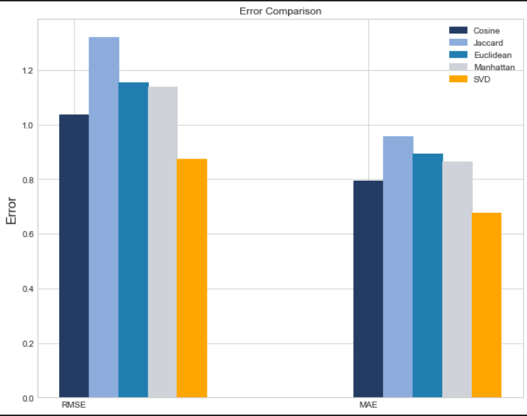

# KNN Movie Recommendation System 🎥

This repository contains the implementation of a movie recommendation system using the K-Nearest Neighbors (KNN) algorithm in Python. The goal of this project is to explore different variations of KNN, including cosine, Jaccard, Euclidean, and Manhattan distance metrics, and compare their performance with Singular Value Decomposition (SVD) for movie recommendation. The MovieLens dataset is used as the primary source of movie ratings.

## Overview ✨

The KNN algorithm is a popular collaborative filtering technique used in recommendation systems. It leverages the similarity between users or items to make predictions for unrated movies. In this project, we focus on user-based collaborative filtering, where the similarity between users is measured based on their movie ratings.

## Variations of KNN 🛣️

The implementation includes variations of KNN that utilize different distance metrics to calculate similarity between users. The available options are:

- **Cosine Similarity:** Measures the cosine of the angle between two users' rating vectors.
- **Jaccard Similarity:** Computes the Jaccard coefficient, which is the size of the intersection divided by the size of the union of the rated movies by two users.
- **Euclidean Distance:** Calculates the Euclidean distance between two users' rating vectors.
- **Manhattan Distance:** Computes the Manhattan distance (also known as the L1 distance) between two users' rating vectors.

These different metrics provide flexibility in capturing user similarity, allowing for more accurate recommendations based on specific characteristics of the dataset.

## SVD Comparison

To evaluate the performance of the KNN algorithm, we compare it with Singular Value Decomposition (SVD), a matrix factorization technique commonly used in recommendation systems. SVD decomposes the rating matrix into lower-rank matrices to approximate the original matrix and make predictions. By comparing the results of KNN and SVD, we can assess the effectiveness of each approach in generating movie recommendations.

## Dataset

The MovieLens dataset is used for this project, which provides a collection of movie ratings from various users. It contains a rich set of movie attributes, such as title, genre, and user ratings. The dataset is preprocessed and provided in a suitable format for the implementation.

## License

This project is licensed under the MIT License. See the `LICENSE` file for more information.

## Acknowledgments

We would like to acknowledge the creators and maintainers of the MovieLens dataset for providing a valuable resource for research and experimentation in the field of recommender systems.

Enjoy exploring different variations of KNN for movie recommendation using Python and the MovieLens dataset!
